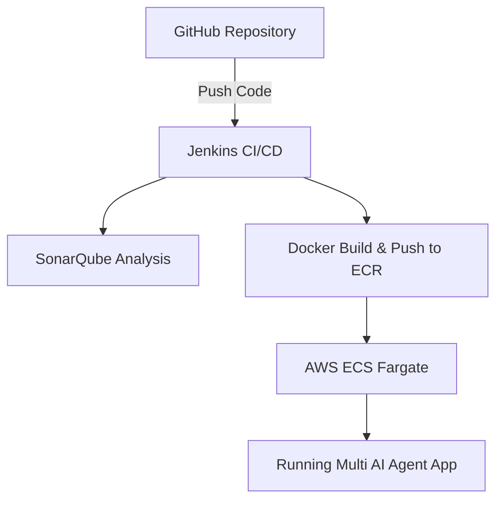
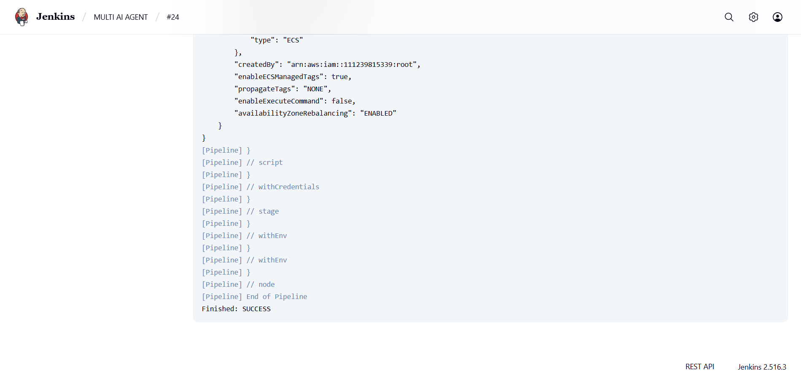
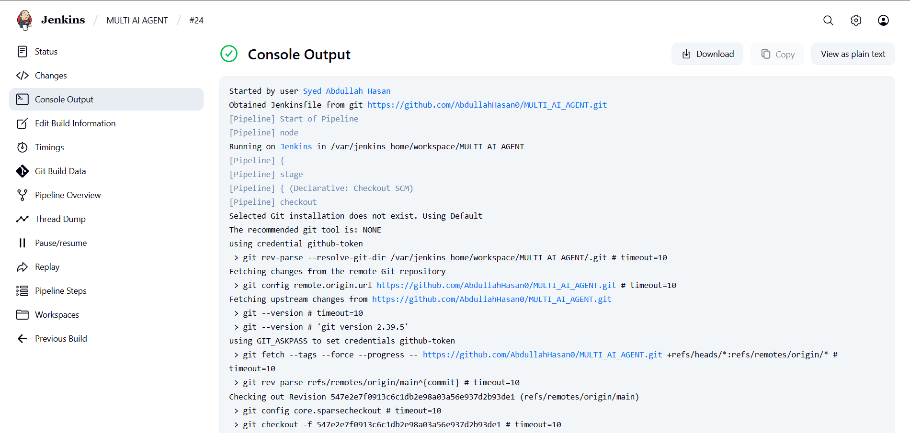
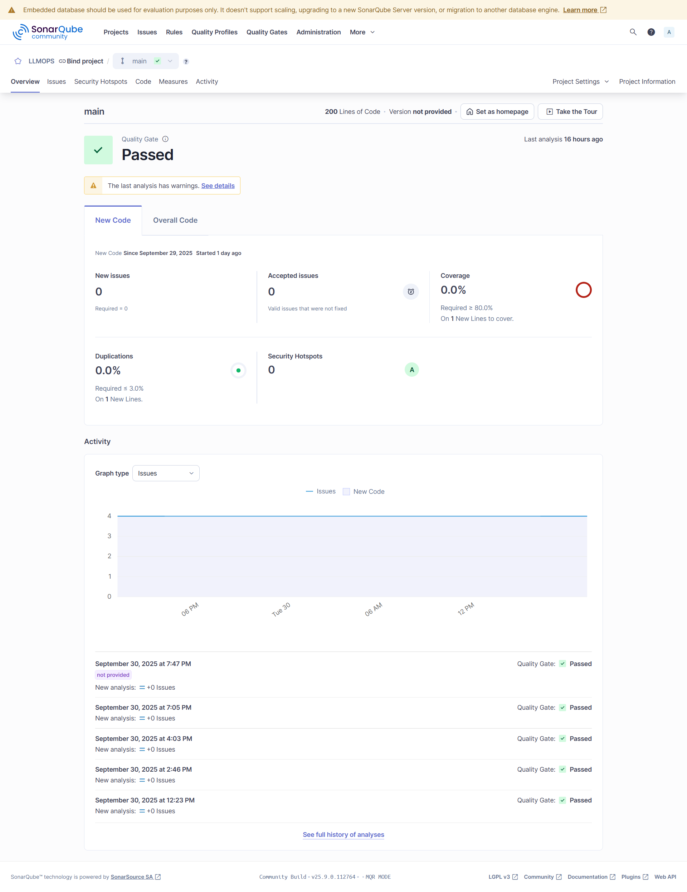
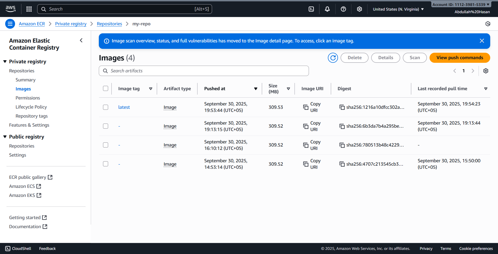
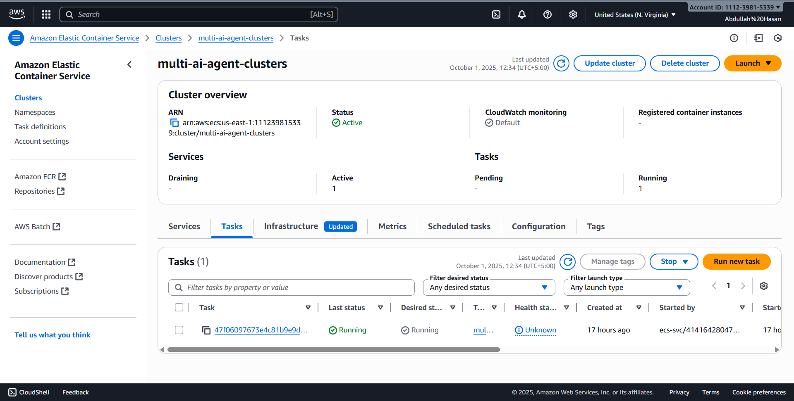
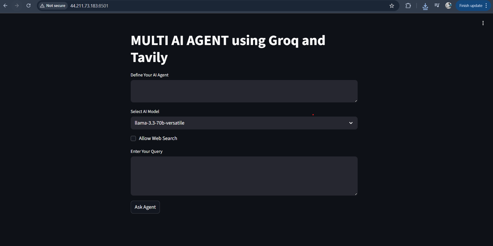

# Multi AI Agent Deployment (CI/CD + AWS Fargate)


A production-grade multi-agent AI system built with FastAPI + LangChain + LangGraph, deployed using a complete MLOps pipeline:
Jenkins → SonarQube → Docker → AWS ECR → AWS ECS Fargate.

This project demonstrates real-world CI/CD, security scanning, and cloud deployment for AI applications.

## 📑 Table of Contents
- [Overview](#overview)
- [Architecture](#architecture)
- [Tech Stack](#tech-stack)
- [Setup Instructions](#setup-instructions)
- [CI/CD Pipeline](#cicd-pipeline)
- [Deployment](#deployment)
- [Screenshots](#screenshots)
- [Future Improvements](#future-improvements)
- [License](#license)

## Overview

- This project implements a Multi-Agent AI System with the following features:
- Multiple AI agents powered by LangChain + LangGraph
- FastAPI backend for handling user requests
- Dockerized pipeline with security + quality checks
- CI/CD with Jenkins, integrated with SonarQube (code quality) 
- Automated build & push to AWS ECR
- Deployment to AWS ECS Fargate

Note: The AWS server has been shut down to avoid costs.
The full pipeline is implemented and reproducible.


## Architecture



## Tech Stack

- Backend: FastAPI, LangChain, LangGraph
- CI/CD: Jenkins (Docker-in-Docker)
- Code Quality: SonarQube
- Containerization: Docker, Docker Compose
- Cloud Deployment: AWS ECR, ECS Fargate

## ⚙️ Setup Instructions

1. **Clone Repository**
   ```bash
   git clone https://github.com/YOUR-USERNAME/MULTI-AI-AGENT-PROJECTS.git
   cd MULTI-AI-AGENT-PROJECTS
   ```
2. **Create Virtual Environment**
   ```bash
    python -m venv venv
    source venv/bin/activate    # Mac/Linux
    venv\Scripts\activate       # Windows
   ```
3. **Create Virtual Environment**
   ```bash
    Install Dependencies
   ```
4. **Run Locally**
   ```bash
   python app/main.py
   ```

## CI/CD Pipeline
- The pipeline automates:
- Checkout – Pull latest code from GitHub
- SonarQube Analysis – Code quality and maintainability check
- Docker Build – Build container image
- Push to AWS ECR – Store image in private registry
- Deploy to AWS ECS Fargate – Run production-ready container

## Deployment

- The app was deployed on AWS ECS Fargate (serverless container service).
- Jenkins automated the deployment pipeline.
- Exposed via public IP on port 8501.

### Note: The live app has been shut down to avoid AWS costs. You can run the application locally using the setup instructions above.

## 🖼 Screenshots

📌 Add these images inside an `images/` folder in your repo and reference them below.

| Stage | Screenshot |
|-------|------------|
| Jenkins Pipeline Success <br> Console Output |  <br>  |
| SonarQube Dashboard (Project Analysis) |  |
| AWS ECR Repository with Docker Image |  |
| AWS ECS Task Running |  |
| App Running in Browser (FastAPI/Agents UI) |  |


## Future Improvements

- Add support for more AI agents (e.g., vision models).
- Implement Redis for caching agent outputs.
- Add monitoring & logging dashboards with Grafana.
-Extend deployment to Kubernetes.

## License
This project is licensed under the MIT License.
